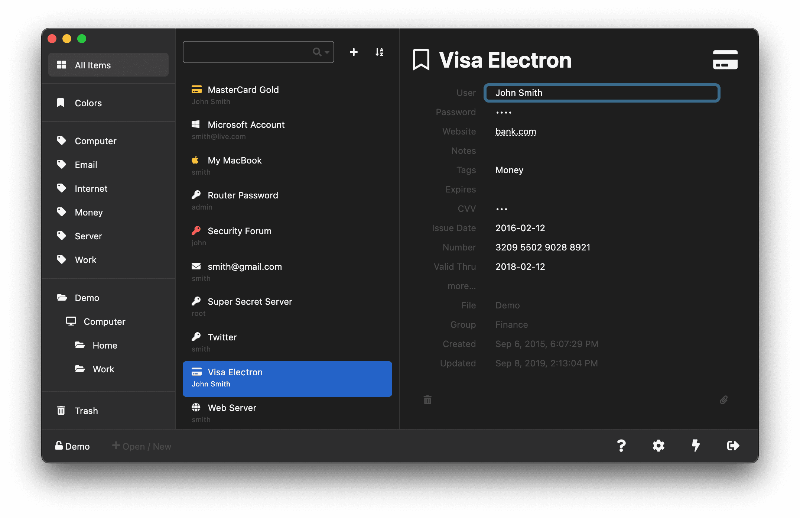

# Secure Vault 🔐

A modern, secure password manager that helps you store and manage your credentials locally. Built with security and privacy in mind, it provides a user-friendly interface for managing your passwords and sensitive information.

<p align="center"></p>

## ✨ Features

- 🔒 Local-first storage with strong encryption
- 🌐 Cross-platform support (Windows, macOS, Linux)
- 📱 Modern, responsive user interface
- 🔑 Secure password generation
- 📝 Password strength analysis
- 🔍 Advanced search capabilities
- 🔄 Auto-fill support
- 🔐 Two-factor authentication support

## 🚀 Quick Start

### Prerequisites

- Node.js >= 10.0
- npm or yarn

### Installation

1. Clone and setup:
```bash
git clone https://github.com/ritikavyas/PASSWORD-MANAGER.git
cd secure-vault
npm install
```

2. Run development server:
```bash
npm run dev-legacy
```

3. For desktop app:
```bash
npm run electron
```

Access the application at `http://localhost:8085`

## 🛠️ Development

### Building from Source

```bash
# For Windows
npm run dev-desktop-windows

# For Linux
npm run dev-desktop-linux

# For macOS
npm run dev-desktop-macos
```

### Debugging

1. Run `npm run dev`
2. Open `http://localhost:8085`
3. Use browser dev tools for debugging

## 🔐 Security Features

- End-to-end encryption
- Zero-knowledge architecture
- Local storage by default
- Strong password generation
- Password strength analysis
- Two-factor authentication
- Secure auto-fill

## 🤝 Contributing

We welcome contributions! Please read our [Contributing Guidelines](CONTRIBUTING.md) before submitting pull requests.

## 📄 License

This project is licensed under the MIT License - see the [LICENSE](LICENSE) file for details.
